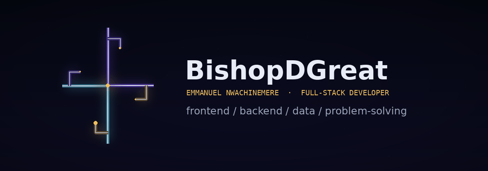
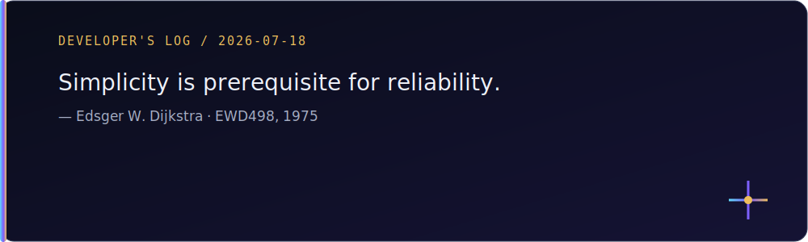

  <picture>
    <source media="(prefers-reduced-motion: reduce)" srcset="assets/header-static.svg">
    
  </picture>

<h1 align="center">BishopDGreat</h1>

<strong>Emmanuel Nwachinemere · Full-Stack Developer · Lagos, Nigeria</strong>

I build web apps with React, TypeScript, Node.js, and MongoDB. I care about how they feel to use, and I care just as much about what happens behind the screen.

  <a href="mailto:nwachinemereemmanuel43@gmail.com">Email me</a> ·
  <a href="https://www.linkedin.com/in/emmanuel-nwachinemere-b166aa234/">LinkedIn</a> ·
  <a href="assets/Emmanuel_Nwachinemere_Full_Stack_Developer_CV.pdf">View designed résumé</a> ·
  <a href="assets/Emmanuel_Nwachinemere_Full_Stack_Developer_ATS_CV.pdf">Download ATS résumé</a>

<strong>I'm open to full-time roles, contract work, freelance projects, and good ideas worth building.</strong>

## What I build

Most of my work starts in React and TypeScript, but I am comfortable following a feature into the API and database when that is what it needs. I pay attention to the less glamorous parts too: loading states, broken inputs, useful errors, mobile layouts, and code I can still understand a month later.

- **Frontend:** HTML, CSS, JavaScript, TypeScript, React, Tailwind CSS, Bootstrap, Vite
- **Backend & data:** Node.js, Express, REST APIs, MongoDB, Mongoose
- **Workflow:** Git, GitHub, Figma, Vercel, Netlify

## Featured work

### [Calculator](https://github.com/GlitchingghosT/Calculator) · [Live demo](https://magnificent-heliotrope-8e9d7b.netlify.app/)

I built this calculator to get the small details right: keyboard input, chained calculations, percentages, saved themes, readable numbers, and a result display that works with screen readers. Its calculation engine is covered by automated tests.

`React` `TypeScript` `Vitest` `Tailwind CSS`

### [Around the Globe](https://github.com/GlitchingghosT/around-the-globe) · [Live demo](https://around-the-globe-three.vercel.app)

Browse 250 country and territory records, filter them by name or region, open a country for more detail, and follow its border links. It also has light and dark themes and direct URLs that work when shared or refreshed.

`React` `TypeScript` `React Router` `Tailwind CSS`

### [Space Tourism Explorer](https://github.com/GlitchingghosT/space-tourism-explorer) · [Live demo](https://let-s-tour-space-together.vercel.app)

This started as a Frontend Mentor challenge. I used it to practise page transitions, route-based navigation, responsive layouts, and animated destination, crew, and technology screens.

`React` `TypeScript` `Framer Motion` `React Router`

### [TaskDuty — Personal Task Manager](https://github.com/GlitchingghosT/personal-task-manager) · In development

TaskDuty is where I am putting the full stack together. The React interface and MongoDB-backed Express API are in place; connecting the two, adding authentication, and separating each user's tasks are the next pieces. It is still in development, so I am not pretending it is finished.

`React` `TypeScript` `Express` `MongoDB` `Mongoose`

## What I'm working on now

- Connecting TaskDuty's frontend to its API
- Adding authentication and making sure users only see their own tasks
- Writing more tests for the projects I plan to keep growing
- Improving accessibility and mobile behavior as I revisit older work

## Developer's Log

I keep a small local collection of quotes that have shaped how I think about software. The card is generated from that list and keeps the original attribution.

## Contact

- **Email:** [nwachinemereemmanuel43@gmail.com](mailto:nwachinemereemmanuel43@gmail.com)
- **LinkedIn:** [Emmanuel Nwachinemere](https://www.linkedin.com/in/emmanuel-nwachinemere-b166aa234/)
- **Location:** Lagos, Nigeria
- **Availability:** Full-time roles, contracts, freelance work, and collaborations

---

Built and maintained by BishopDGreat.

